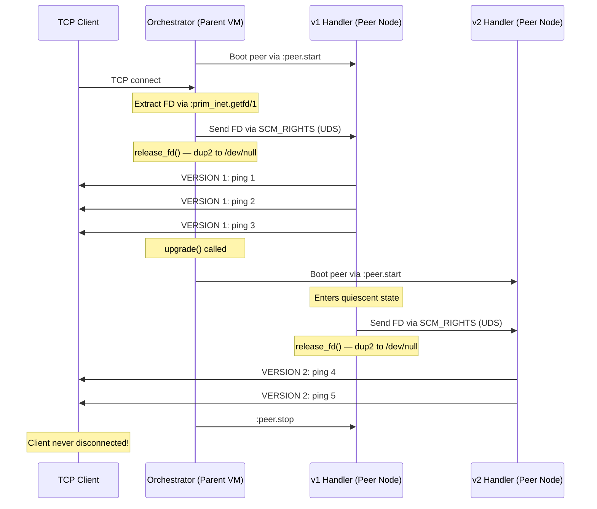
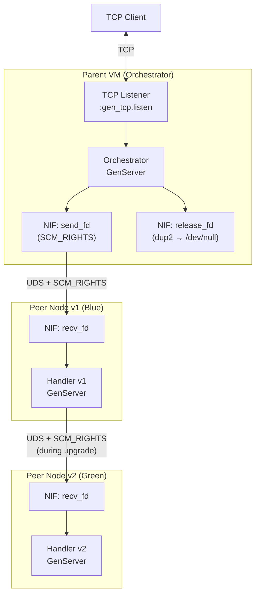
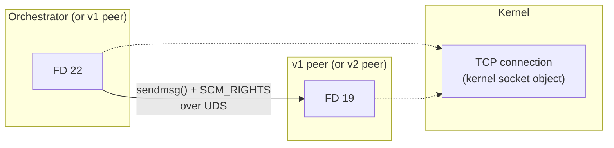

# Hot Blue-Green TCP Handoff with Elixir Peer Nodes

Zero-downtime deployment where running TCP connections survive a code upgrade — no disconnects, no load balancer tricks, no dropped packets.

## Inspiration

This project was inspired by [Chris McCord's tweet thread](https://x.com/chris_mccord/status/2029630330630508929) about `FlyDeploy.BlueGreen` — a system that boots your entire OTP supervision tree inside a `:peer` node, then seamlessly cuts over to a new version:

> The Erlang VM has all these incredible things. Did you know you can boot a `:peer` node as a VM within the VM, fully meshed? Enter `FlyDeploy.BlueGreen` — "hot bluegreen" deploys where we spin up the new incoming VM, then cutover seamlessly.
>
> — Chris McCord ([@chris_mccord](https://x.com/chris_mccord))

Chris's insight was that you can restructure your `Application.start/2` to delegate the real app startup into a peer node, while the "parent" VM acts as a thin control plane that brokers the cutover:

```elixir
defmodule MyApp.Application do
  use Application

  # This runs in the "Parent" (Shim) VM
  def start(type, args) do
    FlyDeploy.BlueGreen.start_link(
      [{DNSCluster, query: "app.internal"}],
      otp_app: :my_app,
      start: {__MODULE__, :start_app, [type, args]}
    )
  end

  # This is called by the Parent to boot the actual app in a Peer VM
  def start_app(_type, _args) do
    children = [
      MyApp.Repo,
      {Phoenix.PubSub, name: MyApp.PubSub},
      MyAppWeb.Endpoint
    ]

    Supervisor.start_link(children, strategy: :one_for_one)
  end
end
```

As Chris noted: *"this could be easily generalized to any place. The only fly specific thing is leveraging fly builders + private registry to get the code to an s3 bucket."*

This project is a standalone proof-of-concept that takes that idea and runs with it, demonstrating the actual TCP socket handoff mechanism using `SCM_RIGHTS`.

## What it does



The client sends "ping N" every 2 seconds and gets back "VERSION X: ping N". When the upgrade happens, the version number changes — but the TCP connection never drops.

## Architecture



Three OS processes are involved:
- **Parent VM** — the long-lived orchestrator that owns the TCP listener
- **Peer v1 (Blue)** — a full BEAM spawned via `:peer.start`, running the Handler
- **Peer v2 (Green)** — the new version, started during upgrade

All three are Erlang-distributed and fully meshed. The parent can call functions on any peer via `:erpc`.

## How the pieces fit together

### 1. The Orchestrator

The `Orchestrator` GenServer owns the TCP listen socket and manages the peer lifecycle. When a client connects:

```elixir
def handle_info({:new_client, client_socket}, state) do
  {:ok, fd} = BlueGreen.FdUtil.extract_fd(client_socket)

  # Start receiver on the peer, then send FD
  start_receiver_on_peer(state.active_node, state.active_version, uds_path)
  :ok = BlueGreen.SocketHandoff.send_fd(uds_path, fd)

  # Release our copy — dup2 to /dev/null
  :ok = BlueGreen.SocketHandoff.release_fd(fd)
  ...
end
```

### 2. Peer nodes via `:peer`

OTP's `:peer` module spawns a child BEAM as a separate OS process. The parent passes its code paths so the peer can run the same modules:

```elixir
defp start_peer_node(version) do
  code_paths = :code.get_path()
  pa_args = Enum.flat_map(code_paths, fn p -> [~c"-pa", p] end)
  cookie_args = [~c"-setcookie", Atom.to_charlist(:erlang.get_cookie())]

  {:ok, peer, node} = :peer.start(%{
    name: String.to_atom("v#{version}"),
    args: pa_args ++ cookie_args,
    connection: :standard_io
  })

  {peer, node}
end
```

The parent can call functions on the peer via `:erpc.call/2` — this is how it starts the receiver and later tells the handler to hand off.

### 3. SCM_RIGHTS via Rust NIF

The FD transfer uses `sendmsg()` / `recvmsg()` with `SCM_RIGHTS` ancillary messages, wrapped in a Rustler NIF. The kernel creates a new FD in the receiver that points to the same TCP connection:



### 4. Clean FD release with `dup2(/dev/null)`

After passing an FD via `SCM_RIGHTS`, the sender must release its copy. But we can't use `gen_tcp.close/1` or `:socket.close/1` — both call `shutdown()` which sends a TCP FIN and kills the connection for *all* holders.

Instead, a NIF uses `dup2()` to atomically replace the socket FD with `/dev/null`:

```rust
#[rustler::nif]
fn release_fd(fd: i32) -> NifResult<Atom> {
    let devnull = std::fs::File::open("/dev/null")?;
    let devnull_fd = devnull.into_raw_fd();
    nix::unistd::dup2(devnull_fd, fd)?;
    nix::unistd::close(devnull_fd)?;
    Ok(atoms::ok())
}
```

This:
- **Decrements** the kernel socket's refcount (so it fully closes when the new owner is done)
- **Leaves** the Erlang port driver with a valid FD (`/dev/null`) — safe for GC
- **Avoids** `shutdown()` — no TCP FIN sent

### 5. The hot upgrade

When `BlueGreen.Orchestrator.upgrade()` is called:

1. Spawn a new peer node (v2)
2. Start a UDS receiver on v2 (blocks waiting for FD)
3. Tell v1's Handler to hand off via `:erpc`
4. v1 sends its FD to v2 via `SCM_RIGHTS`, then releases its copy
5. v2 wraps the FD, starts echoing with the new version prefix
6. v1 peer is stopped

The client sees `VERSION 1` responses seamlessly transition to `VERSION 2`.

## Running the demo

```bash
# Terminal 1: start the server
just start

# Terminal 2: connect the test client
just client

# Terminal 3: trigger the upgrade (while client is running)
just upgrade
```

Or run everything automated:

```bash
just auto
```

Output:

```
[Client] #1 -> VERSION 1: ping 1
[Client] #2 -> VERSION 1: ping 2
...
═══════════════════════════════════════
  🔄  TRIGGERING HOT UPGRADE v1 → v2
═══════════════════════════════════════
...
[Client] #8 -> VERSION 2: ping 8    ← handoff happened!
[Client] #9 -> VERSION 2: ping 9
```

## Why this matters

Traditional blue-green deployments at the infrastructure level are "cold" — the load balancer shifts traffic, but existing connections are severed or drained. This is painful for:

- **Stateful sessions** — collaborative editors, game servers, chat
- **Long-lived connections** — WebSockets, SSE, IoT command streams
- **Edge computing** — where container restarts are expensive

The BEAM's `:peer` module turns a running VM into a fleet manager. Combined with `SCM_RIGHTS` for zero-copy socket transfer, you get deployments where the old and new code are clustered together, can hand off state over Erlang distribution, and the network connection survives the transition without the client ever knowing.

As Chris McCord put it: *"Again and again Erlang continues to blow my mind 12+ years in."*

## Further reading

- [Chris McCord's tweet thread on FlyDeploy.BlueGreen](https://x.com/chris_mccord/status/2029630330630508929)
- [OTP `:peer` module docs](https://www.erlang.org/doc/man/peer)
- [Rustler — Rust NIFs for Erlang/Elixir](https://github.com/rusterlium/rustler)
- [`SCM_RIGHTS` man page (unix(7))](https://man7.org/linux/man-pages/man7/unix.7.html)
- [hand_off_to_rust](https://github.com/chgeuer/hand_off_to_rust) — a sibling project that hands off a TCP socket from Elixir to a standalone Rust process
